## Monitoring System

The monitoring system for the fleet of machines created in Assignment 2, will consist of Prometheus and Grafana.
Prometheus Node Exporter will be used to scrape data from all the machines, while Prometheus will serve as the central monitoring platform, collecting that scraped data. Prometheus Alert Manager will be configured to forward Prometheus alerts to a channel on a Team via a Microsoft Teams webhook. Grafana will be used to collect the Prometheus-gathered data in a rich and modern visualization format.

## Setup

On each machine the following commands need to be run to prepare for the
setup of Puppet, which will deploy the monitoring system and its components.

### Hostfile setup

- Create the `/etc/hosts` file on each machine.

```bash
sudo tee -a /etc/hosts << EOF
192.168.50.14 batcsg1-web.op.ac.nz batcsg1-web
192.168.50.161 batcsg1-app.op.ac.nz batcsg1-app
192.168.50.203 batcsg1-db.op.ac.nz batcsg1-db
EOF
```
### Key-based SSH setup

From your host add these following lines to your SSH config

```bash
tee -a ~/.ssh/config ~ << EOF
Host batcsg1-web
    HostName 202.49.242.203 # Floating IP
    User ubuntu
    IdentityFile ~/.ssh/batcsg1-keypair

Host batcsg1-app batcsg1-db
    HostName %h
    User ubuntu
    IdentityFile ~/.ssh/batcsg1-keypair
    ProxyJump batcsg1-web
EOF
```

### Install base packages

- Install required packages on the web server

```bash
ssh batcsg1-web # Run from the `sb-vm`
```

```bash
ssh batcsg1-app # Run from the `sb-vm` in a second window
```

```bash
ssh batcsg1-db # Run from the `sb-vm` in a third window
```

- Install required packages on the `app` and `db` and `web` servers

```bash
sudo apt update
sudo apt install -y iputils-ping git vim nano
```

### Installing Puppet

- Install `puppetserver` and `puppet-agent` on `batcsg1-web`

```bash
wget https://apt.puppet.com/puppet8-release-jammy.deb
sudo dpkg -i puppet8-release-jammy.deb
sudo apt update
sudo apt install -y puppetserver puppet-agent
echo 'export PATH=$PATH:/opt/puppetlabs/bin' >> ~/.bashrc
echo "alias pp='sudo /opt/puppetlabs/bin/puppet'" >> ~/.bashrc
echo "alias pps='sudo /opt/puppetlabs/bin/puppetserver'" >> ~/.bashrc
source ~/.bashrc
```

- Install `puppet-agent` on `batcsg1-db` and `batcsg1-app`


```bash
wget https://apt.puppet.com/puppet8-release-jammy.deb
sudo dpkg -i puppet8-release-jammy.deb
sudo apt update
sudo apt install -y puppet-agent
echo 'export PATH=$PATH:/opt/puppetlabs/bin' >> ~/.bashrc
echo "alias pp='sudo /opt/puppetlabs/bin/puppet'" >> ~/.bashrc
source ~/.bashrc
```

### Configuring Puppet

- Setup the certificate name on each machine to be set to the **FQDN**

```bash
pp config set certname $(hostname -f) --section main
```

- Set an aggresively small memory cap for Puppetserver on the `web` machine

```bash
sudo sed -i 's/-Xms[0-9]*[mg] -Xmx[0-9]*[mg]/-Xms512m -Xmx512m/' /etc/default/puppetserver
sudo systemctl daemon-reload
```
- Allocate **1G** swap as a safety buffer on the `web` machine

```bash
sudo fallocate -l 1G /swapfile
sudo chmod 600 /swapfile
sudo mkswap /swapfile
sudo swapon /swapfile
echo '/swapfile none swap sw 0 0' | sudo tee -a /etc/fstab
free -h   # confirm swap shows up
```


- On the all machines local Puppet agents, set the `web` server to be the Puppet server

```bash
pp config set server batcsg1-web.op.ac.nz --section main
```

- On the `web` machine enable and start the Puppet server

```bash
sudo systemctl enable --now puppetserver
```

- On all the machines start and enable the Puppet agent

```bash
sudo systemctl enable --now puppet
```

- On the `db` and `app` machines view the logs of the Puppet agent daemon

```bash
sudo journalctl -u puppet -f
```

- On the `web` server, sign the incoming certificateds from the `app` and `db` machines

```bash
pps ca list --all
```

You should see the following certificate requests generated from the `app` and `db` machines.

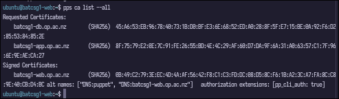

- Sign the agent certificates on the `web` machine

```bash
pps ca sign --all
```

Once signed you should see the following output, confirming both the `app` and `db` certificates have been signed.


Verify the agent certificates are signed by the Puppet CA

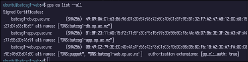

### Deploying Git Puppet code to live production Puppet code

#### Generating `r10k` SSH keys

- Make a dedicated SSH directory for the `puppet` user

```bash
sudo mkdir -p /etc/puppetlabs/puppet/.ssh
sudo chown puppet:puppet /etc/puppetlabs/puppet/.ssh
sudo chmod 700 /etc/puppetlabs/puppet/.ssh
```
- Generate an SSH keypair to setup the deploy keys for the `adv-cloud-computing` repository

```bash
sudo -u puppet ssh-keygen -t ed25519 -C "batcsg1-web r10k deploy" \
  -f /etc/puppetlabs/puppet/.ssh/id_ed25519_r10k -N ""
```

- Create the r10k directory and the configuration file

```bash
sudo mkdir -p /etc/puppetlabs/r10k
sudo tee /etc/puppetlabs/r10k/r10k.yaml > /dev/null <<'EOF'
---
# cachedir is where r10k caches git clones
cachedir: '/var/cache/r10k'

git:
  private_key: '/etc/puppetlabs/puppet/.ssh/id_ed25519_r10k'

sources:
  control:
    remote: 'git@github.com:batcsg1/adv-cloud-computing.git'
    basedir: '/etc/puppetlabs/code/environments'
EOF
```

- Create the r10k cache directory

```bash
sudo mkdir -p /var/cache/r10k
sudo chown puppet:puppet /var/cache/r10k
```

- View the public r10k key

```bash
sudo cat /etc/puppetlabs/puppet/.ssh/id_ed25519_r10k.pub
```

- Copy the contents of the public key to the GitHub repo: https://github.com/batcsg1/adv-cloud-computing

Go to 'Settings'
- On the left panel, navigate down to 'Deploy keys'

- Fill in the title
- Paste the public key into the box where it says 'Key'


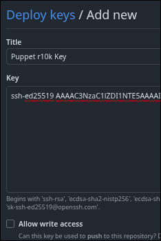

- Select 'Allow write access'

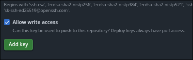

- Verify the connection to `github.com` using the private r10k key in the Puppet user's SSH directory

```bash
sudo ssh -i /etc/puppetlabs/puppet/.ssh/id_ed25519_r10k -T git@github.com
```

You should get prompted for if you want to connect, enter 'Yes'

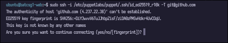

You should see the following message:

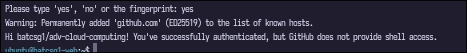

Install Puppet r10k on the `web` machine

```bash
sudo apt install -y ruby ruby-dev build-essential
sudo gem install r10k --no-document
```

Verify `r10k` is installed simply by running:

```bash
which r10k
```

#### Cloning the GitHub repo

```bash
sudo GIT_SSH_COMMAND='ssh -i /etc/puppetlabs/puppet/.ssh/id_ed25519_r10k -o IdentitiesOnly=yes' \
  git clone git@github.com:batcsg1/adv-cloud-computing.git
```

Change the ownership of the local repo to be set to the `ubuntu` user

```bash
sudo chown -R ubuntu:ubuntu ~/adv-cloud-computing
```

Run the following commands to be able to pull changes from the GitHub repo properly

```bash
cd ~/adv-cloud-computing
sudo git config core.sshCommand 'ssh -i /etc/puppetlabs/puppet/.ssh/id_ed25519_r10k -o IdentitiesOnly=yes'
sudo git pull
```

### Running r10k to deploy repo code to live Puppet code

```bash
sudo mkdir -p /root/.ssh && sudo chmod 700 /root/.ssh
sudo tee /root/.ssh/config > /dev/null <<'EOF'
Host github.com
  IdentityFile /etc/puppetlabs/puppet/.ssh/id_ed25519_r10k
  IdentitiesOnly yes
EOF
sudo chmod 600 /root/.ssh/config
```

Finally run the command to deploy the git Puppet code to the `web` machine's live Puppet code

```bash
sudo r10k deploy environment production -pv
```

You should see the following output:

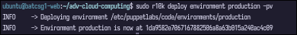

Verify the Puppet production environment folder was created and list its contents

```bash
ls /etc/puppetlabs/code/environments/production/
```
You should see the `modules` folder

#### Run the Puppet agent on all machines

```bash
pp agent -t
```

## Grafana

Verified I could successfully access my Grafana server running on the `web` server

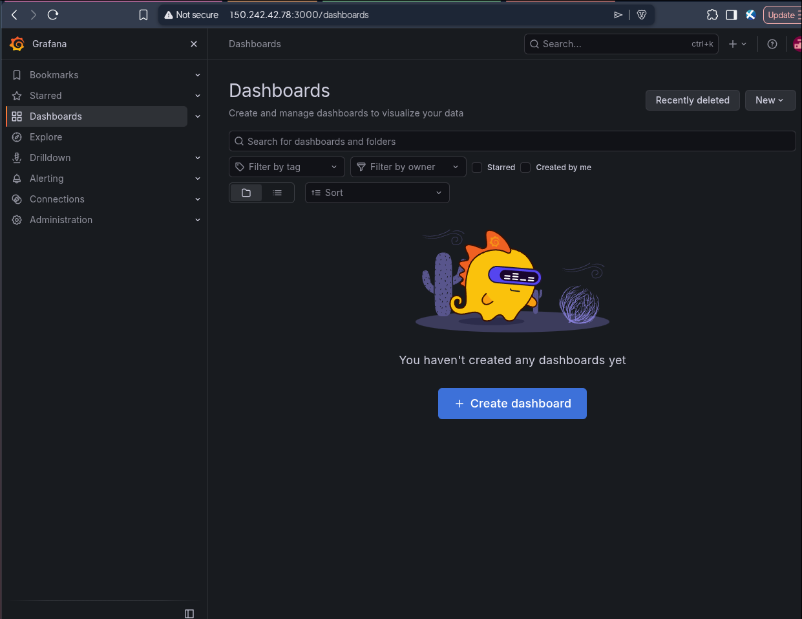

Had to add the local Prometheus server as a data source by navigating through the left panel and going through:

'Connections' > 'Data sources'

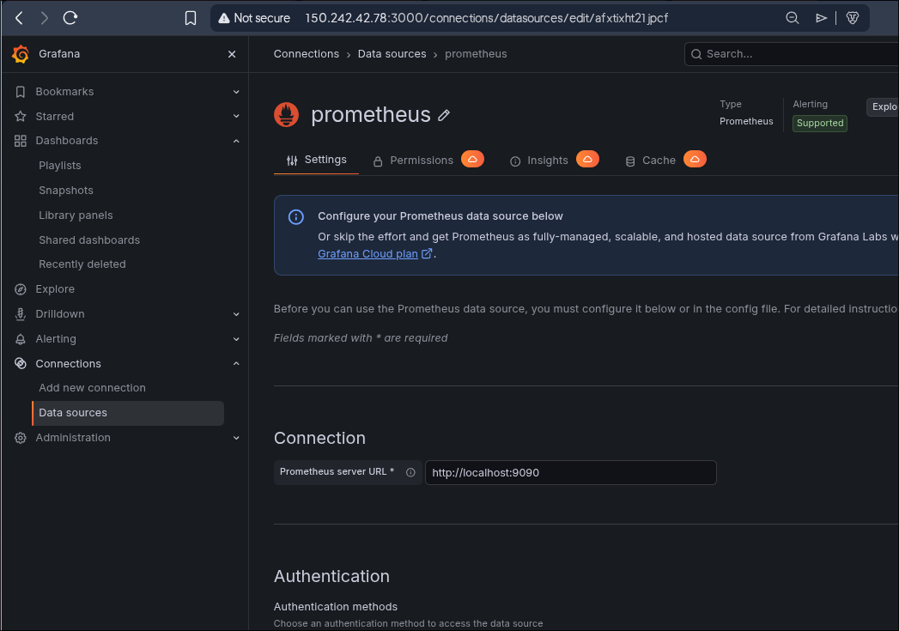

### Grafana Dashboard

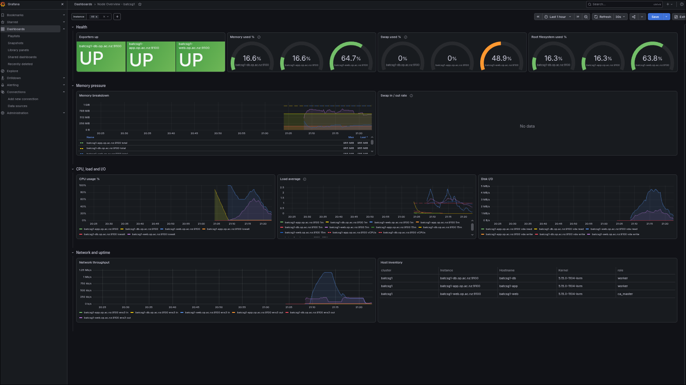

### Alerts

Turned off my `app` server on the Catalyst Cloud Portal

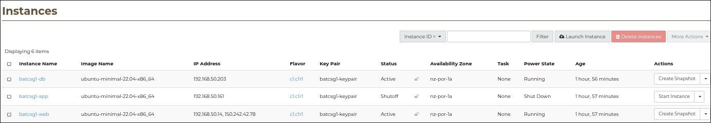

Verified the `app` server appeared as down on my custom Grafana dashboard.

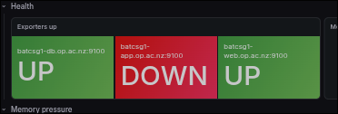

### Microsoft Teams

On Microsoft Teams I created my own Teams and added a dedicated channel specifically for Prometheus alerts

Successfully verified I received a Prometheus based alert on my dedicated Teams channel.

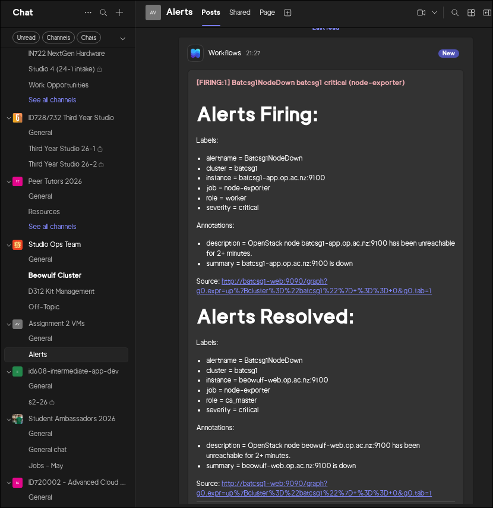


## Prometheus

Verified I could successfully access my Prometheus server, and all nodes are reachable.

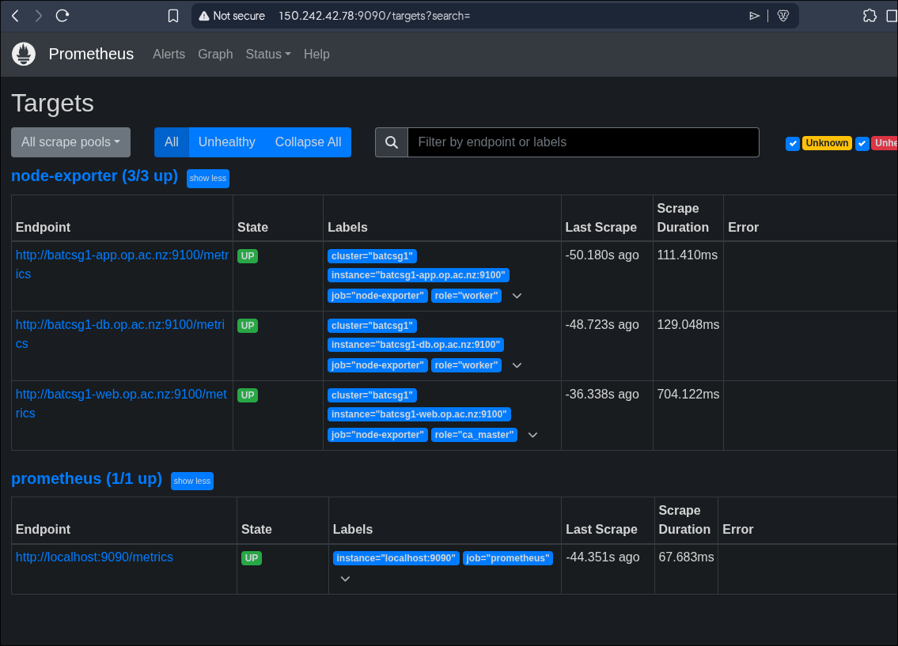